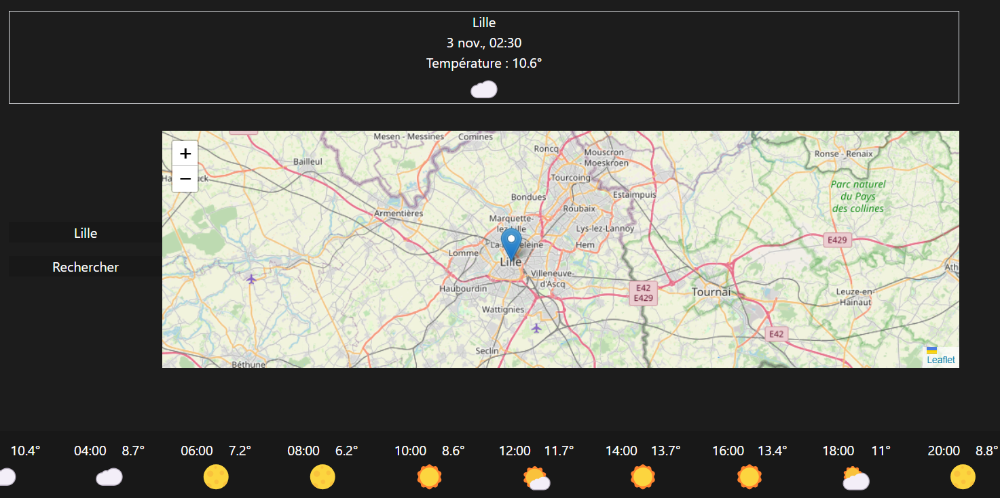

# 🖋️ Weather Report - Votre application concernant la météo

**Weather Report** est une application web conçu afin de pouvoir consulter la météo près de chez vous et dans une ville sélectionnée. Ce projet est développé avec **REACT.js** pour la rapidité et l'efficacité du rendu, Tailwind pour le design côté client.



## 🛠️ Fonctionnalités

- **Sytème de météo** : La météo est accessible pour votre position, donannt un détail heure par heure pendant 7 jours.

## 📂 Structure du projet

Le projet contient les principaux dossiers suivants :

- `weatherclient/` : contient l'ensemble du projet.
- `Components/` : composants réutilisables dans les différentes pages.
- `Views/` : pages de l'application.
- `public/` : ressources statiques, y compris les images et icônes.

## 🚀 Installation et lancement

1. **Clonez le dépôt** :
   ```bash
   cd /weatherclient
   npm i
   npm run start
   ```